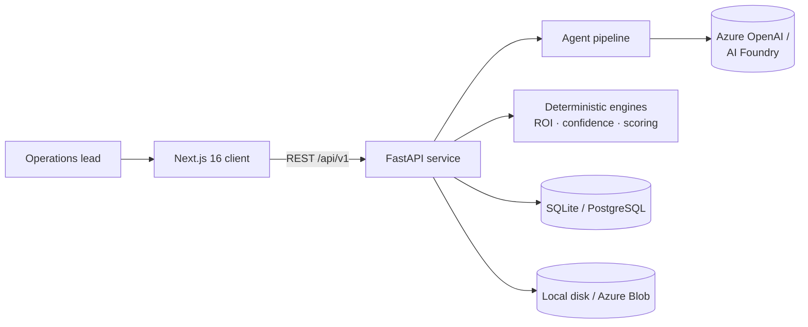
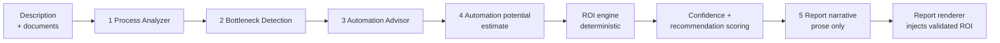

# ProcessPilot AI

[](https://www.python.org/)
[](https://fastapi.tiangolo.com/)
[](https://nextjs.org/)
[](https://react.dev/)
[](https://azure.microsoft.com/products/ai-services/openai-service)
[](backend/tests)

**AI-powered business process optimization.** Describe a business process in plain language —
optionally attaching SOPs, policies or process documents — and ProcessPilot AI returns a
structured process model, ranked bottlenecks, Microsoft-first automation recommendations, a
defensible ROI business case, and a consultant-grade executive report.

Built for CIOs, COOs, operations managers and transformation leads who need to move from
"we think this is slow" to a costed, prioritised action plan.

---

## Contents

- [What it produces](#what-it-produces)
- [The ROI guarantee](#the-roi-guarantee)
- [Architecture](#architecture)
- [Quick start](#quick-start)
- [Configuration](#configuration)
- [API overview](#api-overview)
- [Testing](#testing)
- [Docker](#docker)
- [Project structure](#project-structure)
- [Production readiness](#production-readiness)
- [Documentation](#documentation)

---

## What it produces

| Output | Description |
|--------|-------------|
| **Process model** | Ordered steps, actors, systems, approval gates and manual tasks |
| **Bottlenecks** | Ranked by severity, each tied to a specific step, hand-off or control |
| **Automation potential** | The share of current effort automation can realistically remove |
| **Analysis confidence** | A 0–100 evidence score with the reasons behind it and the gaps that remain |
| **Recommendations** | Scored, prioritised, costed, and mapped to specific Microsoft services |
| **Quick Wins** | At most three genuinely low-friction, high-impact items deliverable in 30 days |
| **ROI business case** | Hours recovered and productivity value, monthly and annual |
| **Executive report** | An 11-section Markdown report in a professional consulting tone |
| **30-60-90 roadmap** | Phased delivery plan derived from the recommendation scores |

Recommendations prioritise Microsoft 365 Copilot, Power Automate, Power Apps, Azure AI Foundry,
Azure OpenAI, Azure AI Search, Azure AI Document Intelligence and Microsoft Graph.

---

## The ROI guarantee

The headline design constraint: **the analysis and the executive report can never disagree.**

Every ROI figure is calculated exactly once, by a deterministic decimal engine
([`roi_service.py`](backend/app/services/roi_service.py)), and the resulting object is reused
verbatim by the API response, the database row and the report. The language model is never
asked to calculate, adjust, round or restate a number.

```
current_monthly_hours      = monthly_volume × minutes_per_case / 60
estimated_hours_saved      = current_monthly_hours × automation_potential_percentage / 100
remaining_monthly_hours    = current_monthly_hours − estimated_hours_saved
monthly_productivity_value = estimated_hours_saved × hourly_cost
annual_productivity_value  = monthly_productivity_value × 12
```

How the guarantee is enforced:

- **`Decimal` end to end.** No binary-float drift in financial values.
- **Rounding happens once**, at presentation: hours ≤ 2 dp, currency exactly 2 dp,
  percentages ≤ 1 dp. Annual value derives from the *unrounded* monthly value, so
  `5.8333… → 5.83`/month and `70.00`/year — not `69.96`. Small values never collapse to zero.
- **The LLM writes prose only.** The report agent returns a schema with no numeric fields.
- **The backend renders every figure.** The Business Case section is generated from the
  validated ROI object, not from model output.
- **Unbacked figures are stripped.** Any sentence stating a number the ROI engine did not
  produce is removed before rendering and logged as `report_narrative_contains_unbacked_figures`.
- **Savings never double-count.** Per-recommendation hours are apportioned by score so they
  sum to — and can never exceed — the overall `estimated_hours_saved`.
- **Confidence and priority are deterministic**, driven by configurable weights in
  [`scoring_config.py`](backend/app/core/scoring_config.py), not by the model.

Worked example — identical on every surface:

| Input | Result |
|-------|--------|
| 120 cases/month · 40 min/case · $28/h · 55% | 80 h current · 44 h saved · 36 h remaining · $1,232/month · $14,784/year |

---

## Architecture

A two-part monorepo: an async FastAPI service and a Next.js client.



The analysis pipeline separates reasoning from arithmetic:



Steps 1–5 are the only LLM calls. Everything between the ROI engine and the renderer is pure,
reproducible Python.

**Backend** — clean architecture with inward-pointing dependencies: `api → services → agents →
repositories → models`. Concrete implementations are injected through FastAPI dependencies, so
`MockLLMClient` and `AzureOpenAIClient` are interchangeable behind an `LLMClient` protocol.

**Frontend** — Next.js App Router with a three-tab workflow (Analyze → Insights → Roadmap),
Tailwind CSS 4, Radix primitives and Framer Motion.

---

## Quick start

Requires **Python 3.12+** and **Node.js 20+**.

### 1. Backend

```powershell
cd backend

python -m venv .venv
.\.venv\Scripts\Activate.ps1
pip install -r requirements.txt

Copy-Item .env.example .env
az login                      # only if using a real Azure OpenAI endpoint
uvicorn app.main:app --reload
```

```bash
cd backend
python3.12 -m venv .venv && source .venv/bin/activate
pip install -r requirements.txt
cp .env.example .env
az login
uvicorn app.main:app --reload
```

- Swagger UI — <http://localhost:8000/docs>
- ReDoc — <http://localhost:8000/redoc>
- Liveness — <http://localhost:8000/health>

The SQLite schema is created, migrated and seeded with a demo user automatically on startup.

> **No Azure OpenAI resource?** Leave `AZURE_OPENAI_ENDPOINT` blank. The service falls back to
> a deterministic `MockLLMClient`, so every endpoint returns realistic, schema-valid data fully
> offline. `GET /health/ready` reports which mode is active.

### 2. Frontend

```bash
cd frontend
npm install
cp .env.example .env.local     # Copy-Item on PowerShell
npm run dev
```

Open <http://localhost:3000>. The backend must be reachable at `NEXT_PUBLIC_API_URL`
(default `http://127.0.0.1:8000`).

---

## Configuration

All backend settings are environment variables bound by Pydantic Settings. See
[`backend/.env.example`](backend/.env.example) for the annotated list.

| Variable | Default | Notes |
|----------|---------|-------|
| `AZURE_OPENAI_ENDPOINT` | empty | Blank ⇒ mock LLM; otherwise authenticate with `az login` |
| `AZURE_OPENAI_DEPLOYMENT` | `gpt-4o` | Deployment name, not the model name |
| `USE_MOCK_LLM` | `false` | Force the mock even when Azure OpenAI is configured |
| `DATABASE_URL` | `sqlite+aiosqlite:///./processpilot.db` | Swap for `postgresql+asyncpg://…` |
| `STORAGE_BACKEND` | `local` | `local` or `azure_blob` |
| `MOCK_AUTH_ENABLED` | `true` | MVP: unauthenticated requests resolve to the demo user |
| `JWT_SECRET_KEY` | `change-me-in-production` | **Must** be rotated before deployment |
| `CORS_ORIGINS` | `http://localhost:3000` | Comma-separated |
| `APPLICATIONINSIGHTS_CONNECTION_STRING` | empty | Enables Azure Monitor log export |

Frontend: `NEXT_PUBLIC_API_URL` in `.env.local`.

Authentication uses Microsoft Entra ID via `DefaultAzureCredential`/`AzureCliCredential` — no
API keys are stored. The signed-in identity needs the **Cognitive Services OpenAI User** role
on the resource.

---

## API overview

Business endpoints are versioned under `/api/v1`; health probes are unversioned so
infrastructure checks stay stable.

| Method | Path | Description |
|--------|------|-------------|
| `GET` | `/health` · `/health/ready` | Liveness and readiness (database + LLM mode) |
| `POST` | `/api/v1/process/analyze` | Run the full agent pipeline |
| `POST` | `/api/v1/process/roi` | Deterministic ROI calculation, no LLM call |
| `GET` | `/api/v1/process/analyses` | Paginated list of the caller's analyses |
| `GET` | `/api/v1/process/analyses/{id}` | Retrieve a stored analysis |
| `DELETE` | `/api/v1/process/analyses/{id}` | Delete an analysis (manager or above) |
| `POST` | `/api/v1/report/generate` | Generate the executive report |
| `POST` | `/api/v1/documents/upload` | Upload a PDF, DOCX or TXT (≤ 10 MB) |
| `POST` | `/api/v1/auth/register` · `/login` | Account creation and JWT issuance |

Runnable request/response samples: [`backend/API_EXAMPLES.md`](backend/API_EXAMPLES.md).

Every error uses a single envelope:

```json
{
  "error": { "code": "not_found", "message": "Analysis 'abc' was not found." },
  "correlation_id": "0f3c1c1e-..."
}
```

---

## Testing

```bash
cd backend
pytest                                                   # whole suite
pytest --cov=app --cov-report=term-missing               # coverage gate at 80%
pytest tests/integration/test_roi_consistency.py         # the ROI guarantees
```

119 tests run entirely offline — in-memory SQLite, the mock LLM and a temp-directory storage
backend, all injected through FastAPI dependency overrides. No network, no Azure resource and
no API keys required.

Coverage includes ROI boundary cases (fractional hours, zero cost, 0% and 100% reduction,
invalid input, million-row volumes), cross-surface consistency, savings-allocation limits,
Quick Win selection rules, report sanitisation and schema migration.

---

## Docker

```bash
cd backend
cp .env.example .env

docker compose up --build              # API only, SQLite + local storage
docker compose --profile postgres up   # API + PostgreSQL
```

Slim Python 3.12 image with a `/health` healthcheck and a non-root runtime user.

---

## Project structure

```
ProcessPilot-AI/
├── backend/                   FastAPI service
│   ├── app/
│   │   ├── api/               Routers and dependency wiring
│   │   ├── agents/            The five single-responsibility LLM agents
│   │   ├── core/              Config, logging, security, scoring weights
│   │   ├── db/                Async session, schema init and migration
│   │   ├── models/            SQLAlchemy aggregates
│   │   ├── prompts/           Versioned prompt templates
│   │   ├── repositories/      Persistence boundary
│   │   ├── schemas/           Pydantic v2 contracts
│   │   └── services/          ROI, confidence, scoring, analysis, reporting
│   └── tests/                 Unit and integration suites
└── frontend/                  Next.js client
    ├── app/                   App Router pages and layout
    ├── components/ui/         Reusable UI primitives
    └── lib/api.ts             Typed API client
```

---

## Production readiness

| Concern | Today | Path forward |
|---------|-------|--------------|
| Database | SQLite via `aiosqlite` | Point `DATABASE_URL` at PostgreSQL; `asyncpg` is already a dependency |
| Migrations | Additive schema sync on startup | Adopt Alembic (already a dependency) |
| Auth | Mock principal for MVP convenience | Set `MOCK_AUTH_ENABLED=false` and issue real JWTs |
| Storage | Local disk | Set `STORAGE_BACKEND=azure_blob` |
| Pipeline | Synchronous request | Move long analyses to a background worker |
| Money columns | SQL `FLOAT`, quantised on read | Migrate to `NUMERIC` for a financial system of record |

Observability is production-shaped already: structured JSON logs, a correlation ID propagated
through every request and log line, token and latency accounting per LLM call, an immutable
audit trail, and optional Application Insights export. Secrets, tokens and document contents
are never logged.

---

## Documentation

- [Backend README](backend/README.md) — architecture, agent contracts, ROI formulas,
  scoring weights, security and observability in depth
- [API examples](backend/API_EXAMPLES.md) — runnable request and response samples
- [Frontend README](frontend/README.md) — client setup

---

## License

No license file is currently present. Add a `LICENSE` before distributing or open-sourcing
this project.
